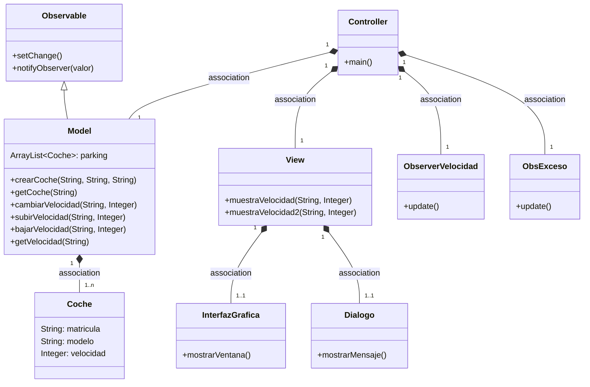
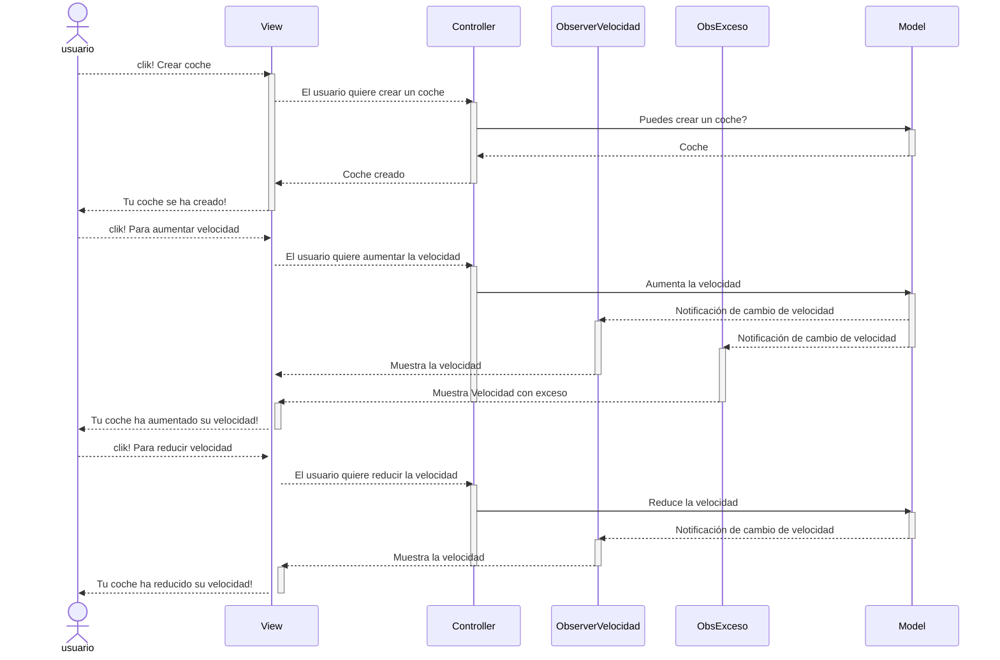
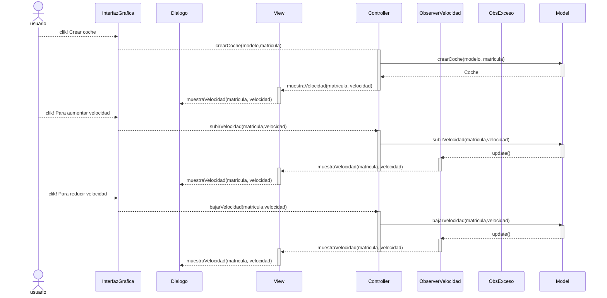

# Arquitectura MVC con Observer

Aplicación que trabaja con objetos coches, modifica la velocidad y la muestra.

Los cambios de la velocidad que se hagan en el model serán observados por el Controller.

Para notificar a los observadores se hacen dos pasos:
1. Se actualiza el estado de 'algo a cambiado' con `setChange()`
2. Se notifica a los observadores `notifyObservers(valor)`

De esta manera se dispara en todos los observadores el método `update()`

---
## Diagrama de clases:

---

## Diagrama de Secuencia
### Evento en el View
El observer está para controlar el cambio de velocidad

El mismo diagrama con los nombres de los métodos
